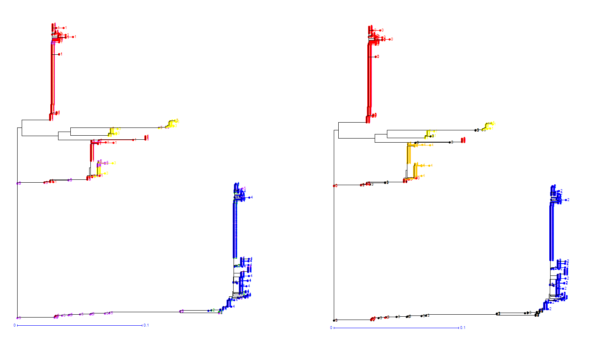

### Darwin plots 

Script to extract genotype data to DARwin DataMatrix format.

takes as input a .geno file, as well as `.bim` and `.fam` files from in [plink](http://zzz.bwh.harvard.edu/plink/) format.
Takes admx and reference files with accession IDs and population code (command line [example](Darwin_KDE_command.txt)). Admx population codes are not used. Reference population 
codes are used to perform [kernel density estimation](https://scikit-learn.org/stable/modules/density.html) following dimensionality reduction.

Genotype data along the region provided using the arguments `--start` and `--end` is reduced through principal component analysis (`--ncomp` to set
number of dimensions to retain. 5 max advisable for KDE). 

DataMatrix is produced along with `*ID.txt` table of ID to label. The columns can be pasted to the .don file to color the trees in DARwin.

- DARwin website: [http://darwin.cirad.fr/](http://darwin.cirad.fr/)

**Example**

qSH1 locus, *Oryza sativa*, 165 SNPs across 19932 bp region.

